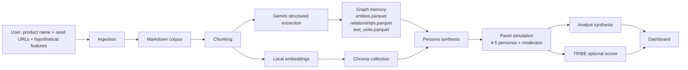
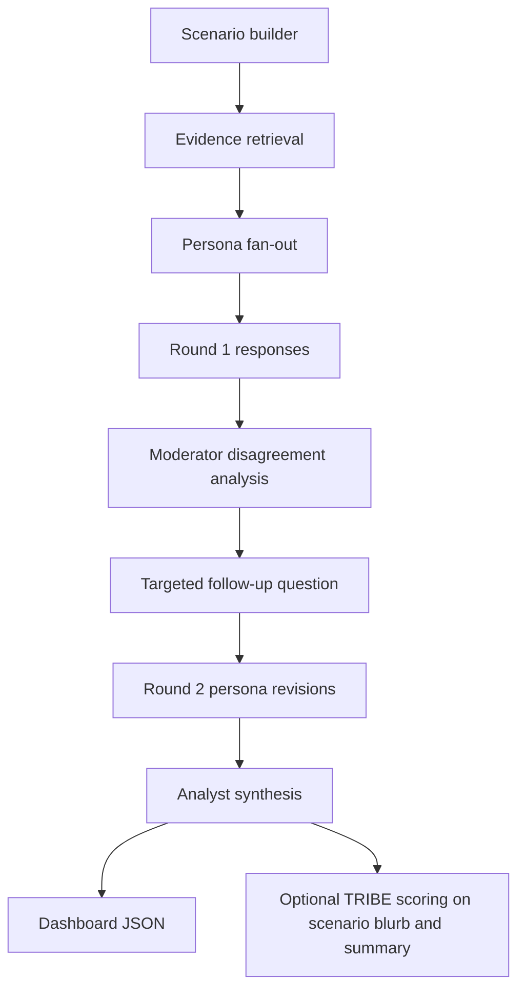

# PanelForge MVP Research Report

## Executive summary

The most feasible 24-hour version of **PanelForge / Synthetic Focus Groups** is **not** a full end-to-end “live internet + full GraphRAG + heavy multi-agent + neuroscience” system. The feasible version is a **localhost MVP** that does five things well: it ingests seed URLs into Markdown, builds a **GraphRAG-style graph memory** plus a **local vector store**, synthesizes **4–5 evidence-grounded personas**, runs a **two-round moderated panel simulation**, and renders an **analytics dashboard**. The strongest implementation path is a **Bring Your Own Graph** approach aligned to Microsoft GraphRAG’s expected tables, with **Chroma** as the app-facing vector DB, **sentence-transformers/all-MiniLM-L6-v2** as the local embedding model, **Gemini** for structured extraction and panel outputs, and **TRIBE v2** as a **secondary exploratory scorer**, not the primary truth signal. Microsoft’s GraphRAG docs now explicitly support Gemini through LiteLLM, and GraphRAG’s BYOG flow only requires `entities.parquet`, `relationships.parquet`, and optionally `text_units.parquet` to run the summarization/query workflows. citeturn26view0turn36view0turn37view0turn23search0

The biggest practical insight is that **TRIBE v2 is the riskiest component**. The official release is real and open, with code, model weights, and a demo, but it is a **brain-response prediction model for in-silico neuroscience**, released under **CC-BY-NC-4.0**, with active public questions around commercial licensing. The released checkpoint is about **709 MB**, the repo requires **Python 3.11+** and **torch>=2.5.1,<2.7**, and at least one user has already reported **CUDA OOM on a 14.56 GiB Colab GPU**. More importantly for your “all localhost” goal, the repo’s `text_path` helper currently converts text with **gTTS** and then transcribes with **WhisperX via `uvx`**, meaning the official text flow is **not fully offline** as shipped. That does not kill the project, but it means the correct architecture is to treat TRIBE as an **optional post-hoc scorer** on a few short concept narratives, ideally by feeding it **local audio** generated with an offline TTS such as Piper rather than relying on the repo’s default `text_path` helper. citeturn10view0turn11view0turn13view0turn17view0turn16view0turn39view0turn40view0turn42search0turn42search3turn43search0

The core recommendation is therefore:

- **Use Gemini for all extraction, persona generation, moderation, and final synthesis**
- **Use local MiniLM embeddings + Chroma for retrieval**
- **Use a GraphRAG-compatible graph schema stored as Parquet + NetworkX/igraph**
- **Run a simple deterministic orchestrator first, then wrap in LangGraph only if time remains**
- **Use TRIBE as an optional “brain-response style” exploratory feature on 2–5 scenarios during the demo**
- **Frame the output as evidence-grounded synthetic focus groups, not as real consumer prediction or neuroscience truth** citeturn31search8turn46view4turn46view5turn33search2turn48search0turn47view1turn45view1turn46view0

## Feasibility and architecture recommendation

A minimal, judge-friendly system should be framed as a **decision-support prototype for concept testing**: the user enters a product name, seed links, and optional hypothetical features; the system expands the evidence set, normalizes it into Markdown, builds a graph of features/claims/concerns/competitors, synthesizes personas from that evidence, and simulates a moderated focus group that outputs consensus, disagreement, risk, and recommended messaging. This is useful because it compresses a messy discovery process into an evidence-linked dashboard. The graph layer makes the panel less gimmicky than plain “five LLMs chatting,” because each persona is grounded in retrieved chunks and graph neighborhoods rather than free-floating stereotypes. GraphRAG’s BYOG workflow is especially well suited here because it lets you provide the graph yourself and then run only the workflows you need, instead of paying the complexity cost of the full default indexer. citeturn36view0turn37view0turn25search16

For a 24-hour hackathon, the best architecture is a **two-memory design**. The first memory is a **GraphRAG-style graph memory** stored as Parquet tables plus a lightweight in-process graph object for traversal and visualization. The second memory is a **local vector DB** used by the personas and moderator to retrieve evidence quickly. That split keeps the system simple: the graph handles relationships, communities, and disagreement traces; the vector DB handles semantic recall. Chroma is the stronger default than FAISS for this specific app because it gives you **local persistence**, **metadata filtering**, and a clean client model without forcing you to build your own metadata sidecar. FAISS remains the best fallback if you need the absolute lightest ANN component and are willing to manage metadata yourself. citeturn48search0turn48search2turn47view1turn45view1



The tradeoff table below reflects the architecture that minimizes complexity while preserving “wow factor.” The underlying behaviors are documented in the cited official materials; the selection itself is the recommendation for this MVP. citeturn48search0turn47view1turn45view1turn46view0turn33search0turn33search2turn33search4

| Decision area | Best default for this MVP | Why |
|---|---|---|
| Graph layer | GraphRAG-style BYOG tables + NetworkX/igraph | Lowest complexity, GraphRAG-compatible outputs, easy local visualization |
| Vector DB | **Chroma** | Persistent local collections, metadata filters, straightforward Python DX |
| Embeddings | **sentence-transformers/all-MiniLM-L6-v2** | Local, fast, 384-dim, good enough for semantic recall |
| LLM | **Gemini** | Strong structured outputs, Pydantic/JSON schema support |
| Orchestration | **Simple asyncio state machine** first | Faster to ship than LangGraph when the workflow is fixed |
| Agent framework fallback | LangGraph | Worth adding only if you want interrupts/persistence/debug traces |
| Cognitive scorer | **TRIBE v2 optional** | High wow factor, but risky and should remain secondary |
| Frontend graph viz | react-force-graph or Cytoscape.js | Quick to demo; fit depends on whether you want “wow” vs stable node browsing |

A second comparison matters because you explicitly asked for it: retrieval stack choice. Sentence-Transformers is the right default here because it is local and designed for semantic search; Gemini embeddings are stronger when you can afford API dependence and larger vectors; DistilBERT is small and fast, but a raw DistilBERT checkpoint is not the best retrieval baseline unless you fine-tune or wrap it properly for sentence embeddings. Google’s embedding docs expose 3072-dimensional default vectors and recommend 768/1536/3072 output sizes; the MiniLM model card exposes a **384-dimensional** semantic-search-oriented embedding space; DistilBERT’s official material describes it as a smaller, faster distilled language model rather than a purpose-built retrieval encoder. citeturn33search0turn33search3turn33search2turn46view6turn46view7turn33search4turn33search11

| Retrieval option | Strengths | Weaknesses | Recommendation |
|---|---|---|---|
| **sentence-transformers/all-MiniLM-L6-v2** | Local, fast, 384-dim, proven semantic search fit | Not frontier-quality on every niche domain | **Use for MVP** |
| Gemini embeddings | Potentially higher quality, scalable dimensions, multilingual | Remote API dependency, larger vectors, more cost | Optional upgrade |
| DistilBERT baseline | Small, fast, cheap | Not retrieval-specialized by default | Do not use as primary retriever |

A final orchestration comparison is simple: LangGraph has documented capabilities for **durable execution**, **human-in-the-loop**, and **memory**, but you do not need those features to ship your first demo. For a fixed panel loop, a typed `asyncio` orchestrator will be easier to build and debug in a day. If by hour 16 everything is stable, you can wrap the same nodes in LangGraph for cleaner traces and a stronger “agentic” story. citeturn46view0turn46view1turn46view2turn24search0

| Orchestrator | Pros | Cons | Use now |
|---|---|---|---|
| **Simple asyncio / custom state machine** | Lowest complexity, deterministic, easy to unit test | Less flashy, fewer built-in traces | **Yes** |
| LangGraph | Durable execution, memory, human interrupts | Extra mental overhead and packaging complexity | Add only if time remains |

## Exact stack, installs, and required downloads

The cleanest compatible backend target is **Python 3.11**, because TRIBE v2’s published package metadata requires **Python >=3.11** and the repo pins **torch>=2.5.1,<2.7**. For the frontend, use **Node 20.19+ or 22.12+**, because current Vite requires that runtime level. On the Python side, the current official packages you care about are GraphRAG **3.0.9**, Chroma **1.5.8**, sentence-transformers **5.4.1**, Google GenAI SDK **1.73.1**, LangGraph **1.1.8**, and FastAPI **0.136.0**. On the frontend side, current packages include React **19.2.5**, Vite **8.0.8**, Tailwind CSS **4.2.2**, Recharts **3.8.1**, and react-force-graph **1.48.2**. citeturn23search0turn23search1turn23search2turn31search0turn24search0turn23search3turn13view0turn29search9turn29search0turn29search1turn29search2turn29search3turn30search0

A pinned backend environment that balances compatibility and simplicity looks like this:

```bash
python3.11 -m venv .venv
source .venv/bin/activate
python -m pip install --upgrade pip setuptools wheel

pip install \
  "google-genai==1.73.1" \
  "graphrag==3.0.9" \
  "chromadb==1.5.8" \
  "sentence-transformers==5.4.1" \
  "fastapi==0.136.0" \
  "pydantic==2.13.2" \
  "trafilatura==2.0.0" \
  "markdownify==1.2.2" \
  "praw==7.8.1" \
  "igraph==1.0.0" \
  "leidenalg==0.11.0" \
  "pandas==3.0.2" \
  "numpy==2.2.6" \
  "uvicorn[standard]"
```

Those package choices are built around the official package/docs versions above, plus the same NumPy line already pinned by TRIBE’s own package metadata. GraphRAG uses LiteLLM internally and supports Gemini models that can reliably return structured JSON matching schema expectations. Sentence-Transformers officially supports semantic search and retrieve/re-rank patterns. citeturn13view0turn26view0turn46view6turn46view8

If you want a FAISS fallback, use **the official install path** rather than fighting wheel compatibility in the hackathon. Faiss’ own docs recommend Conda and expose separate CPU/GPU packages:

```bash
conda install -c pytorch faiss-cpu
# or
conda install -c pytorch faiss-gpu
```

Faiss is a **library** for similarity search and clustering over dense vectors, not a full metadata-aware document database, so you should only choose it if you are willing to maintain metadata in SQLite or DuckDB yourself. citeturn45view1

For TRIBE v2, use a dedicated environment or at least a dedicated install step because its dependency surface is unusual. The official repo and model card show the package install flow, the checkpoint loading API, the weight location, and the license. A practical setup is:

```bash
git clone <facebookresearch/tribev2 repo>
cd tribev2
python -m pip install -e .

# tool used by the released transcription path
uv tool install whisperx

# if needed for HF-gated dependencies
huggingface-cli login
```

You should budget extra time for first-run downloads and dependency resolution. The release exposes `TribeModel.from_pretrained("facebook/tribev2")`, and the published model card links the weights. The checkpoint itself is about **709 MB**. The package metadata shows dependencies including `moviepy`, `gtts`, `spacy`, `transformers`, and `huggingface_hub`. citeturn10view0turn11view0turn13view0turn41search1

For a truly local TRIBE text pipeline, the shipped `text_path` helper is a trap. The repo’s own `demo_utils.py` makes clear that `text_path` is converted to speech via **gTTS** and then transcribed through **WhisperX**. gTTS itself is a library that interfaces with Google Translate’s speech API, which means the default helper is not fully offline. The MVP-safe fix is to generate **local audio** yourself and pass **`audio_path`** into TRIBE. The simplest local TTS fallback is **Piper**, which is an explicitly local neural TTS system; Coqui TTS is a heavier but more flexible fallback. citeturn39view0turn40view0turn42search0turn42search3turn43search0turn43search1

A compact download/reference list is below. Each cited source is the link you can open for the repo, model, docs, or dataset.

| Resource | Use in MVP |
|---|---|
| Microsoft GraphRAG package + docs citeturn23search0turn26view0turn36view0turn37view0 | BYOG-compatible graph workflow and optional native query path |
| Google GenAI SDK + Gemini structured output docs citeturn31search8turn31search0turn46view4turn46view5 | Structured extraction, personas, moderation, synthesis |
| Chroma docs + package citeturn23search1turn48search0turn48search2turn47view1 | Local persistent vector DB with metadata filters |
| Faiss docs citeturn45view1 | Optional lighter ANN fallback |
| sentence-transformers + all-MiniLM-L6-v2 citeturn23search2turn33search2turn46view7 | Local embeddings |
| LangGraph docs/package citeturn24search0turn46view0 | Optional orchestration layer |
| TRIBE v2 repo + weights + model card citeturn10view0turn11view0turn13view0 | Secondary cognitive-response scorer |
| WhisperX + uv docs citeturn41search0turn41search1turn41search7 | Local transcription in TRIBE pathway |
| Piper / Coqui TTS citeturn43search0turn43search1 | Offline text-to-audio fallback for TRIBE |
| Reddit PRAW docs citeturn32search2turn32search3 | Official Reddit ingestion path |
| YouTube Data API docs citeturn22search2turn22search6 | Video discovery and caption track handling |
| Amazon Reviews 2023 dataset citeturn22search4turn22search0 | Optional offline evaluation/support data |

The hardware floor for the **core MVP without TRIBE** is modest: one modern laptop with **16 GB RAM** is enough. The hardware floor for the **TRIBE-enhanced demo** is materially higher. Because the published repo depends on Torch, multimodal backbones, WhisperX, and users have already hit OOM on a **14.56 GiB** Colab GPU, the safe recommendation is **16 GB VRAM minimum**, **32 GB system RAM preferred**, and a plan to score only a handful of short scenarios. CPU-only execution is possible for the rest of the stack, and even for TRIBE in principle, but it is too risky for a hackathon demo unless you precompute the scores. citeturn17view0turn13view0turn11view0

## Ingestion pipeline, Markdown flow, GraphRAG schema, and vector configuration

Your ingestion layer should make **Markdown** the canonical format. That is the right move because Markdown gives you easy human review, stable diffs, and a clean path into chunking, graph extraction, and prompt grounding. The recommended sources for a concept-test MVP are: **seed URLs supplied by the user**, **public Reddit posts via PRAW**, **YouTube discovery via the YouTube Data API**, and optionally a small offline support corpus such as Amazon Reviews 2023 for category-level priors. Use APIs first when available, then limited web extraction for public pages. Trafilatura is well suited for extracting main article text and metadata from web pages, and Markdownify can normalize HTML to Markdown. PRAW is the official Reddit wrapper and follows Reddit API rules. The YouTube Data API supports search and caption-track discovery, while caption download is subject to availability and permissions. citeturn28search0turn28search1turn32search0turn32search2turn22search2turn22search6turn22search4

The Markdown pipeline should be deterministic:

1. Fetch seed pages and API content  
2. Extract main content and metadata  
3. Write one canonical `.md` file per source with YAML front matter  
4. Chunk the Markdown into evidence units  
5. Store chunks in both JSONL and vector DB  
6. Run Gemini structured extraction over each chunk  
7. Materialize GraphRAG-compatible tables and a local graph object  
8. Generate communities and summaries  
9. Build personas from evidence clusters  
10. Simulate the panel

A canonical Markdown file shape should look like this:

```markdown
---
doc_id: doc_appleinsider_2026_04_17_001
canonical_product: iphone_18
source_type: web_article
source_url: "..."
title: "..."
published_at: "2026-04-17"
author: "..."
language: "en"
retrieved_at: "2026-04-17T13:33:00Z"
---

# Headline

Main body text...

## Key claims
- ...
```

GraphRAG’s BYOG documentation gives you the exact target artifacts that matter. To cover the core query use cases, GraphRAG expects **`entities.parquet`**, **`relationships.parquet`**, and optionally **`text_units.parquet`**. For graph summarization, the essential entity fields are `id`, `title`, `description`, and `text_unit_ids`. For relationships, the essential fields are `id`, `source`, `target`, `description`, `weight`, and `text_unit_ids`, and GraphRAG explicitly notes that the **`weight` field is important for Leiden community computation**. If you want only GraphRAG’s lightweight summarization/global search path, the minimal workflows are `create_communities` and `create_community_reports`; adding `generate_text_embeddings` enables the local/DRIFT-style paths. citeturn36view0turn37view0

A practical graph schema for your app should still be richer than the minimal Parquet contract. Use these node and edge types:

| Node type | Example |
|---|---|
| Product | `iphone_18` |
| Feature | `fourth_rear_lens`, `battery_stack`, `satellite_messaging` |
| Concern | `price_hike`, `repairability`, `thermal_throttling` |
| Competitor | `galaxy_ultra`, `pixel_pro` |
| Segment | `camera_creators`, `value_seekers`, `apple_loyalists`, `android_switchers` |
| SourceDoc | canonical source document |
| TextUnit | chunk-level evidence |
| Scenario | user-injected hypothetical feature combination |
| Claim | normalized proposition such as “4th lens helps zoom workflows” |

| Edge type | Meaning |
|---|---|
| `MENTIONS` | doc/text unit mentions a feature or concern |
| `SUPPORTS` | source evidence supports a claim |
| `CONTRADICTS` | evidence disputes a claim |
| `COMPARES_TO` | feature or product compared to competitor |
| `PREFERS` | segment/persona favors a feature |
| `FEARS` | segment/persona sees risk |
| `DERIVED_FROM` | scenario element created from evidence or user input |
| `CO_OCCURS_WITH` | two concepts repeatedly appear together |

On the vector side, **Chroma** should be your application retrieval layer. Chroma’s docs expose **in-memory**, **persistent**, and **client-server** modes, and show that collections can be queried with a `where` clause over metadata, including `$and`, `$or`, `$gt`, `$in`, and even array metadata with `$contains`. That is perfect for a panel simulator, because you can pull chunks by `facet`, `source_type`, `scenario_id`, `stance`, or `product_line` instead of doing semantics alone. citeturn48search0turn48search2turn47view1

Use this Chroma collection design:

```python
collection_name = "research_chunks"

metadata fields:
- project_id: str
- canonical_product: str
- doc_id: str
- chunk_id: str
- source_type: str               # web_article | reddit_post | reddit_comment | youtube
- section_title: str
- published_at: str
- facet: str                     # camera | battery | price | design | privacy | ecosystem
- stance: str                    # positive | negative | mixed | rumor | review
- scenario_tags: list[str]
- entity_ids: list[str]
- language: str
- evidence_score: float
```

Recommended config for the app-facing store:

```python
# design recommendation, not framework-imposed
embedding_model = "sentence-transformers/all-MiniLM-L6-v2"
embedding_dim = 384
persist_path = "./data/vectors/chroma"
top_k_default = 12
filters = {
  "$and": [
    {"canonical_product": "iphone_18"},
    {"facet": {"$in": ["camera", "price", "battery"]}}
  ]
}
```

Because all-MiniLM-L6-v2 maps sentences and paragraphs to a **384-dimensional** dense vector space intended for semantic tasks, it gives you a much smaller local index than Gemini’s default **3072-dimensional** embeddings. That is precisely why it is the best retrieval default for the hackathon, while Gemini remains your generation model. citeturn33search2turn46view7turn33search0

If you need a FAISS fallback, keep it intentionally simple:

```python
# fallback design
index = faiss.IndexIDMap(faiss.IndexFlatIP(384))
# normalize embeddings before insert/query
# store metadata in sqlite table chunk_meta(chunk_id, doc_id, facet, stance, ...)
```

Faiss is excellent for dense-vector search, supports storage to disk and GPU implementations, and can scale to collections that do not fit fully in RAM. But because it does not give you Chroma-style metadata filtering as an integrated application API, it is only the right choice if you are optimizing for minimal ANN overhead rather than developer speed. citeturn45view1

## Persona synthesis, orchestration flow, simulation loop, and TRIBE plus Gemini integration

The persona layer should be **evidence-synthesized**, not hand-authored. That is where the project becomes more than “LLMs pretending to be users.” The algorithm should work in two passes. In the first pass, Gemini extracts normalized evidence from chunks. In the second pass, you cluster evidence into distinct behavioral segments and ask Gemini to convert those clusters into structured personas that keep references back to the evidence. The personas must always carry `evidence_chunk_ids` and `graph_entity_ids`; otherwise the system will drift into fiction. Gemini’s structured-output support is well suited to this because the official SDK supports **Pydantic** and JSON Schema with `responseMimeType: "application/json"` and `responseJsonSchema`. citeturn46view4turn46view5turn31search8

The recommended persona synthesis algorithm is:

- Extract per-chunk structured fields: feature mentions, pros, cons, segment hints, concern types, competitor references, novelty signals, rumor confidence
- Embed all chunks locally
- Build a chunk-feature matrix keyed by `facet × stance × source_type`
- Run Leiden or k-means to produce **4–5 stable clusters**
- Use Gemini to convert each cluster into a persona JSON object
- Reject any persona whose beliefs are not backed by a minimum evidence threshold
- Freeze the persona for the simulation run

That cluster-first design makes your personas reproducible and auditable. It also plays nicely with GraphRAG, whose own clustering/community flow is Leiden-based and exposes a clustering seed for stable runs. citeturn37view0turn27search0turn27search1

Use a persona schema like this:

```json
{
  "persona_id": "creator_camera_maximalist",
  "segment_label": "Camera-forward creator",
  "summary": "Cares about mobile photography and social content workflows.",
  "jobs_to_be_done": [
    "shoot zoom-heavy clips",
    "edit quickly on-device",
    "post without external camera gear"
  ],
  "feature_priorities": {
    "camera": 0.95,
    "battery": 0.68,
    "price": 0.31,
    "repairability": 0.24
  },
  "skepticism_profile": {
    "leak_trust": 0.45,
    "brand_loyalty": 0.72,
    "competitor_switch_likelihood": 0.18
  },
  "beliefs": [
    {
      "claim": "A fourth lens is useful only if it improves zoom quality materially.",
      "valence": 0.62,
      "confidence": 0.81,
      "evidence_chunk_ids": ["chunk_014", "chunk_091", "chunk_105"]
    }
  ],
  "graph_entity_ids": ["feature_fourth_lens", "concern_price_hike", "segment_camera_creator"],
  "must_cite_evidence": true
}
```

A good Gemini extraction prompt for chunk parsing is:

```text
System:
You are extracting product-research evidence for a synthetic focus-group simulator.
Return valid JSON only.

User:
Given the chunk below, extract:
- entities
- relationships
- claims
- facet
- stance
- segment_hints
- novelty_signals
- evidence_score
- rumor_confidence
- direct_quote_candidates

Chunk metadata:
{metadata}

Chunk text:
{chunk_text}
```

A good Gemini panel-response prompt is:

```text
System:
You are simulating one focus-group participant. Stay consistent with the persona JSON.
Never invent facts. Every claim must map to retrieved evidence chunk IDs.
Return JSON only.

User:
Persona:
{persona_json}

Scenario:
{scenario_json}

Retrieved evidence:
{retrieved_chunks}
{graph_neighbors}

Respond with:
- overall_reaction
- adoption_likelihood_0_100
- strongest_positive
- strongest_concern
- feature_scores
- what_would_change_my_mind
- one quotable sentence
- cited_chunk_ids
```

For orchestration, the fastest path is a lightweight typed state machine. The state shape should include: project metadata, graph handles, vector handles, personas, scenarios, retrieved evidence, round outputs, moderator questions, analyst summary, and optional TRIBE scores. A simple, deterministic flow looks like this:



The exact simulation loop should be:

1. Build a `scenario_json` from user feature ideas plus any inferred features from the corpus  
2. For each persona, retrieve top-K chunks from Chroma with **semantic + metadata** filtering  
3. Pull a graph ego-network around relevant entities and claims  
4. Ask Gemini for a structured first-round response  
5. Compute disagreement signals across personas  
6. Ask a moderator agent to generate one focused follow-up question  
7. Re-run each persona with the same evidence plus the discussion state  
8. Ask an analyst agent to produce consensus, disagreement, feature risk, and messaging recommendations  
9. Optionally score one-paragraph scenario summaries with TRIBE  
10. Save everything as versioned JSON artifacts

That loop is deliberately narrow. It is enough to feel “agentic” without becoming an unreliable freeform conversation simulator. The key mutation step is not freeform memory drift; it is **controlled belief update** after the moderator question. Each persona should update only fields exposed in a narrow response schema, not rewrite its identity. That will keep runs consistent and debuggable.

For TRIBE integration, keep the touchpoints minimal and strategic. The official API path is straightforward: load the model via `TribeModel.from_pretrained("facebook/tribev2")`, create events with `get_events_dataframe(...)`, and call `predict(events)`. The output is an array of predicted brain activity shaped as `(n_segments, n_vertices)`. The official model card states predictions are for the **average subject** on the **fsaverage5 cortical mesh**, and the helper API accepts `video_path`, `audio_path`, or `text_path`. citeturn10view0turn39view0

For this MVP, use TRIBE only at these points:

- **Scenario headline scorer**: score a short 50–120 word concept blurb per scenario  
- **Microcopy comparison**: score 2–3 alternative summaries after the analyst step  
- **Disagreement probe**: score the strongest positive and strongest concern messages separately

Do **not** market the resulting scalar as “attention” or “neural engagement” unless you have a defensible mapping. Instead, expose it as a controlled exploratory metric such as:

- `tribe_response_strength = mean(abs(preds))`
- `tribe_response_variance = std(preds)`
- `tribe_response_spread = fraction of vertices above percentile threshold`

Those are your own heuristics layered on top of the official output, which is predicted cortical activity, not a validated product-market KPI. citeturn10view0turn39view0

The local-running caveat matters enough to state plainly: the official TRIBE text helper currently turns text into audio via **gTTS** and then transcribes with **WhisperX**. That means the easiest text path is not fully local and introduces both networking and dependency risk. Your best localhost workaround is:

```bash
# option A: stay local
echo "short scenario blurb..." > scenario.txt
# synthesize locally with Piper or Coqui -> scenario.wav
# then call TRIBE with audio_path instead of text_path
```

```python
from tribev2 import TribeModel

model = TribeModel.from_pretrained("facebook/tribev2", cache_folder="./cache")

events = model.get_events_dataframe(audio_path="scenario.wav")
preds, segments = model.predict(events)

score = float(abs(preds).mean())
```

This keeps TRIBE in the demo without making the entire product dependent on internet TTS. WhisperX itself can be run with `uvx whisperx`, which the released TRIBE code path uses under the hood. citeturn39view0turn40view0turn41search0turn41search1

Finally, Gemini should be used in a **strict schema-first style** across the whole app. Use **`temperature=0`** for extraction and persona synthesis, then **`0.2` or lower** for panel responses. Use `responseMimeType: "application/json"` and a declared schema for every structure that crosses system boundaries. The official structured-output docs show both **JSON schema** and **Pydantic** patterns in the Google GenAI SDK. citeturn46view4turn46view5turn31search8

A minimal Python call pattern is:

```python
from google import genai
from pydantic import BaseModel

class PersonaResponse(BaseModel):
    overall_reaction: str
    adoption_likelihood_0_100: int
    strongest_positive: str
    strongest_concern: str
    quotable_sentence: str
    cited_chunk_ids: list[str]

client = genai.Client(api_key=os.environ["GEMINI_API_KEY"])

resp = client.models.generate_content(
    model="gemini-2.5-flash",
    contents=prompt_text,
    config={
        "response_mime_type": "application/json",
        "response_schema": PersonaResponse
    }
)
```

## Evaluation, validation, reproducibility, and legal plus ethical guardrails

The MVP must be explicit that it is a **directional synthetic-research tool**, not a replacement for real users. The validation plan should therefore focus on whether the system stays grounded, internally consistent, and directionally useful. The best evaluation regime is a **historical-launch backtest**: choose several past product launches that had a robust pre-launch rumor/discussion phase and then compare the simulator’s pre-launch findings against holdout post-launch reviews and reactions. The goal is not to prove exact prediction accuracy; the goal is to measure whether the simulator surfaces the same *themes*, *risks*, and *tradeoffs* that later became salient. That framing is much more defensible in front of judges and interviewers. citeturn22search4turn36view0

Use five metric families:

| Metric family | What to measure |
|---|---|
| Retrieval quality | Precision@k on manually labeled relevant chunks |
| Grounding quality | % of persona claims backed by chunk IDs |
| Persona stability | Same persona + same scenario gives similar outputs across reruns |
| Simulation usefulness | Theme overlap with holdout review corpus |
| Serialization quality | JSON-validity rate and schema pass rate |

For a fast A/B setup, compare:

- **A:** plain vector RAG + one summarizer  
- **B:** vector RAG + graph neighborhoods + synthetic panel  
- **C:** B plus TRIBE reranking on scenario blurb

If the panel system consistently produces better theme coverage and richer disagreement traces than A, you already have a strong defense. If TRIBE helps choose clearer concept blurbs without materially slowing the system, it earns its keep. If not, demote it to a side widget.

Hallucination control should be implemented structurally, not just with prompts:

- every persona claim must include `cited_chunk_ids`
- any claim with no valid evidence is dropped before the dashboard
- moderator follow-ups can reference only surfaced disagreements
- analyst summaries can reference only persona outputs and retrieved evidence
- user-injected hypothetical features must be labeled as **hypotheses**, not retrieved facts
- unsupported fields should set `evidence_gap=true`

GraphRAG’s configuration also gives you helpful reproducibility hooks. The docs expose a **cache** section for persisted model-call results and a **cluster_graph seed** for stable Leiden communities. Use both. Combine that with frozen dependency versions, prompt hashing, sorted retrieval results, and deterministic persona cluster assignment. citeturn37view0

A strong reproducibility profile for the hackathon is:

```bash
export PYTHONHASHSEED=42
export TOKENIZERS_PARALLELISM=false
```

```python
RANDOM_SEED = 42
EXTRACTION_TEMPERATURE = 0.0
PERSONA_TEMPERATURE = 0.0
SIMULATION_TEMPERATURE = 0.2

# cache key
sha256(model_name + schema_json + prompt_text + retrieved_ids)
```

Also persist these artifacts per run:

- normalized Markdown files
- chunk JSONL
- `entities.parquet`
- `relationships.parquet`
- `text_units.parquet`
- `personas.json`
- `scenario.json`
- `responses_round1.json`
- `responses_round2.json`
- `analyst_summary.json`
- `tribe_scores.json`
- `dashboard_payload.json`

The legal and ethical checklist matters unusually much here because you are mixing scraping, public commentary, and brain-response modeling. The safe checklist is:

| Area | Rule |
|---|---|
| Scraping | Prefer APIs; respect robots.txt, site ToS, and rate limits |
| Privacy | Use only public content; do not store personal data beyond what is necessary for citation |
| Attribution | Preserve source URL, timestamp, and author if present |
| User scenario injection | Label hypothetical features clearly |
| TRIBE scope | Do not claim it reads minds or predicts individual people |
| Commercial use | Treat TRIBE v2 as **non-commercial research use** unless licensing is clarified |
| Human-subject implication | State clearly that synthetic panels do not replace real focus groups |
| Regulated domains | Do not use this MVP for medical, legal, financial, or safety-critical decisions |

That last TRIBE point is especially important. The official model card and repo license use **CC-BY-NC-4.0**, and there are public open issues asking about commercial licensing. In a hackathon, that is fine if you frame the system as a research/demo prototype. In a startup or production pitch, it becomes a blocking issue until clarified. citeturn10view0turn16view0turn18view0

## Delivery plan, repository layout, API contracts, dashboard wireframe, demo script, pitch deck, and judge prep

A 24-hour build is realistic if you split the team hard by risk. You should own architecture, Gemini extraction, persona logic, and orchestration. Friend A should own ingestion, Markdown normalization, Chroma, and GraphRAG-compatible tables. Friend B should own the frontend and keep the demo beautiful from hour 8 onward.

A true hour-by-hour plan looks like this:

| Hour | Owner | Task |
|---|---|---|
| 0 | All | Repo init, env setup, goals locked |
| 1 | You | Define schemas: chunk, entity, relationship, persona, response |
| 2 | Friend A | Seed URL fetcher + Markdown writer |
| 3 | Friend B | Vite/React/Tailwind dashboard scaffold |
| 4 | You | Gemini extraction prompt + Pydantic models |
| 5 | Friend A | Chunker + local file manifests |
| 6 | You | Chroma integration + embedding path |
| 7 | Friend A | Graph builder + Parquet writers |
| 8 | Friend B | Dashboard cards + status views |
| 9 | You | Persona clustering + persona synthesis |
| 10 | Friend A | Retrieval layer: semantic + metadata filters |
| 11 | You | Round-1 simulation loop |
| 12 | Friend B | Charts: consensus, disagreement, evidence coverage |
| 13 | You | Moderator + round-2 follow-up loop |
| 14 | Friend A | Analyst synthesis + export payload |
| 15 | Friend B | Graph explorer + quote wall |
| 16 | You | Smoke tests, schema hardening, error handling |
| 17 | Friend A | Historical example corpus for demo |
| 18 | You | Optional TRIBE spike; if unstable, feature-flag it off |
| 19 | Friend B | TRIBE widget or placeholder panel |
| 20 | All | End-to-end integration |
| 21 | All | Record deterministic demo seed data |
| 22 | You | Pitch narrative + judge answers |
| 23 | All | Rehearsal + screenshots + backup video |

The repository should be boring and obvious:

```text
panelforge/
├── README.md
├── pyproject.toml
├── package.json
├── .env.example
├── .gitignore
├── apps/
│   ├── api/
│   │   ├── main.py
│   │   ├── config.py
│   │   ├── routes/
│   │   │   ├── projects.py
│   │   │   ├── ingest.py
│   │   │   ├── simulate.py
│   │   │   ├── dashboard.py
│   │   │   └── tribe.py
│   │   └── schemas/
│   │       ├── project.py
│   │       ├── chunk.py
│   │       ├── graph.py
│   │       ├── persona.py
│   │       ├── scenario.py
│   │       └── simulation.py
│   └── web/
│       ├── src/
│       │   ├── App.tsx
│       │   ├── pages/ProjectDashboard.tsx
│       │   ├── components/
│       │   │   ├── Header.tsx
│       │   │   ├── IngestForm.tsx
│       │   │   ├── ScenarioEditor.tsx
│       │   │   ├── ConsensusChart.tsx
│       │   │   ├── DisagreementRadar.tsx
│       │   │   ├── PersonaTable.tsx
│       │   │   ├── QuoteWall.tsx
│       │   │   ├── EvidenceGraph.tsx
│       │   │   └── TribePanel.tsx
│       │   └── lib/api.ts
├── core/
│   ├── ingest/
│   │   ├── fetch.py
│   │   ├── reddit.py
│   │   ├── youtube.py
│   │   ├── extract.py
│   │   └── md_writer.py
│   ├── indexing/
│   │   ├── chunk.py
│   │   ├── embed.py
│   │   ├── extract_structured.py
│   │   ├── graph_builder.py
│   │   ├── graph_parquet.py
│   │   └── chroma_store.py
│   ├── personas/
│   │   ├── cluster.py
│   │   ├── synthesize.py
│   │   └── prompts.py
│   ├── simulation/
│   │   ├── retrieve.py
│   │   ├── moderator.py
│   │   ├── analyst.py
│   │   ├── orchestrator.py
│   │   └── prompts.py
│   └── scoring/
│       ├── tribe_runner.py
│       └── heuristics.py
├── data/
│   ├── raw/
│   ├── md/
│   ├── chunks/
│   ├── graph/
│   ├── vectors/
│   ├── cache/
│   └── runs/
├── scripts/
│   ├── bootstrap_demo_project.py
│   ├── run_ingest.py
│   ├── run_simulation.py
│   └── smoke_test_tribe.py
└── tests/
    ├── test_chunking.py
    ├── test_graph_schema.py
    ├── test_persona_schema.py
    └── test_simulation_contracts.py
```

The API should stay small and demonstrable:

```http
POST /api/projects
POST /api/projects/{project_id}/ingest
POST /api/projects/{project_id}/scenarios
POST /api/projects/{project_id}/simulate
GET  /api/projects/{project_id}/dashboard
POST /api/projects/{project_id}/tribe/score
```

Example payloads:

```json
POST /api/projects
{
  "name": "iPhone 18 synthetic focus group",
  "canonical_product": "iphone_18",
  "seed_urls": [
    "https://example.com/spec-rumor-1",
    "https://example.com/forum-thread-2"
  ],
  "user_hypotheses": [
    "Add a fourth rear lens focused on long-range optical zoom",
    "Increase price by $100 to support the camera stack"
  ]
}
```

```json
POST /api/projects/{project_id}/simulate
{
  "scenario_id": "scenario_fourth_lens_v1",
  "panel_size": 5,
  "rounds": 2,
  "facets": ["camera", "battery", "price", "ecosystem"],
  "use_tribe": true
}
```

```json
GET /api/projects/{project_id}/dashboard
{
  "project_id": "proj_001",
  "scenario_id": "scenario_fourth_lens_v1",
  "consensus_score": 0.61,
  "disagreement_score": 0.34,
  "top_risks": [
    {"label": "price_hike", "score": 0.88},
    {"label": "camera_value_unclear", "score": 0.74}
  ],
  "top_wins": [
    {"label": "zoom_use_case", "score": 0.81}
  ],
  "personas": [...],
  "quotes": [...],
  "tribe": {
    "enabled": true,
    "response_strength": 0.42,
    "response_variance": 0.18
  }
}
```

The frontend should be optimized for instant judge comprehension:

| Panel | Visualization | Endpoint |
|---|---|---|
| Project overview | KPI cards | `/dashboard` |
| Consensus vs disagreement | stacked bars + gauges | `/dashboard` |
| Persona breakdown | sortable table | `/dashboard` |
| Feature tradeoff matrix | heatmap | `/dashboard` |
| Evidence graph | force graph / node-link | `/dashboard` |
| Quote wall | masonry cards | `/dashboard` |
| TRIBE widget | small sparkline + note | `/dashboard` |
| Scenario editor | form + chips | `/scenarios` |

A good wireframe is:

```text
┌────────────────────────────────────────────────────────────────────┐
│ PanelForge: iPhone 18 synthetic focus group                       │
│ [Ingested 126 sources] [5 personas] [2 rounds] [TRIBE optional]  │
├────────────────────────────────────────────────────────────────────┤
│ Consensus 61%     Disagreement 34%     Evidence Coverage 89%      │
├───────────────────────┬────────────────────────────────────────────┤
│ Feature Risk Matrix   │ Evidence Graph                            │
│ camera vs price       │ feature <-> concern <-> competitor graph  │
├───────────────────────┼────────────────────────────────────────────┤
│ Persona Table         │ Quote Wall                                │
│ likelihood, concerns  │ “I’d pay more only if zoom is obvious...” │
├───────────────────────┼────────────────────────────────────────────┤
│ Scenario Editor       │ TRIBE Panel                               │
│ add hypotheses        │ response strength / variance / caveat      │
└────────────────────────────────────────────────────────────────────┘
```

The live demo script should be simple and dramatic:

1. Start with a product everyone recognizes  
2. Paste 2–3 seed links and one user-invented hypothesis  
3. Show source pages turning into Markdown  
4. Show the evidence graph lighting up around features and concerns  
5. Open the 5 synthesized personas and emphasize their evidence anchors  
6. Run round 1 and show sharply different reactions  
7. Show the moderator’s targeted follow-up question  
8. Run round 2 and show shifts in agreement  
9. Open the dashboard and point at **top risk**, **top win**, **best quote**, and **feature recommendation**  
10. If TRIBE is on, say: “This is a secondary exploratory signal based on predicted cortical response, not our ground truth”

That last sentence immunizes you against the strongest criticism.

The top judge criticisms and bulletproof answers should be rehearsed exactly:

| Criticism | Best answer |
|---|---|
| “These users are fake.” | “Correct. They are synthetic, not human replacements. The value is faster pre-screening. Every output here is evidence-linked and intended to reduce idea-search cost before real user research.” |
| “Why not just run sentiment analysis?” | “Sentiment collapses nuance. Our graph memory preserves *why* people react, which features drive disagreement, and how different segments trade off price, camera, battery, and ecosystem.” |
| “Why use GraphRAG at all?” | “Because concept testing is relational. Price concerns, feature excitement, competitor comparisons, and rumor credibility interact. A graph exposes those dependencies better than flat chunk retrieval.” |
| “Is TRIBE scientifically valid for product decisions?” | “Not as a primary KPI. We use it as an exploratory secondary scorer on short concepts. The dashboard labels it clearly and never treats it as ground truth.” |
| “Can this hallucinate?” | “We structurally limit that by requiring chunk citations per claim, scoped schemas, and evidence-only summaries. Unsupported claims are dropped before they hit the dashboard.” |
| “Is this commercially usable?” | “The core Gemini + Chroma + GraphRAG-style pipeline is. TRIBE v2 is currently under a non-commercial license, so in production we’d swap or remove that module unless licensing changes.” |
| “Why localhost?” | “Privacy, low latency, and demo reliability. The app-facing memory is local; only Gemini is remote. Even that can be swapped later if needed.” |
| “How do you know the personas aren’t just stereotypes?” | “They are cluster-derived from evidence, not hand-written. Each persona carries evidence chunk IDs and graph anchors, so you can inspect why it exists.” |

A 10-slide pitch deck outline that will read cleanly to judges is:

| Slide | Slide text |
|---|---|
| Title | **PanelForge** — Synthetic focus groups for unreleased product concepts |
| Problem | Teams have ideas fast but research feedback loops are slow, expensive, and noisy |
| Insight | Public discourse already contains segment signals, objections, and feature priors |
| Product | Input a product name, seed links, and hypothetical features; PanelForge simulates evidence-grounded panel reactions |
| Why it works | Markdown corpus → graph memory + vector recall → personas → moderated panel → dashboard |
| Technical moat | GraphRAG-compatible memory, local vector DB, strict Gemini schemas, optional TRIBE scorer |
| Demo flow | Ingest, synthesize personas, simulate, analyze consensus and disagreement |
| Results | Surfaces top risks, strongest wins, quotable user reactions, and concept revisions |
| Differentiation | More grounded than generic agents, more nuanced than sentiment analysis, faster than full user-research loops |
| Ask / Vision | Start as concept triage for product teams; later calibrate on historical launches and human studies |

If you need the shortest possible positioning line for a judge, use this:

**“PanelForge is a local synthetic focus-group engine: it turns messy public product discourse into graph-grounded personas, simulates their reactions to hypothetical features, and gives you an evidence-linked dashboard before you spend on real user research.”**